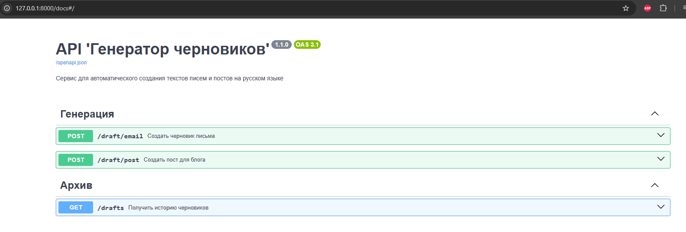
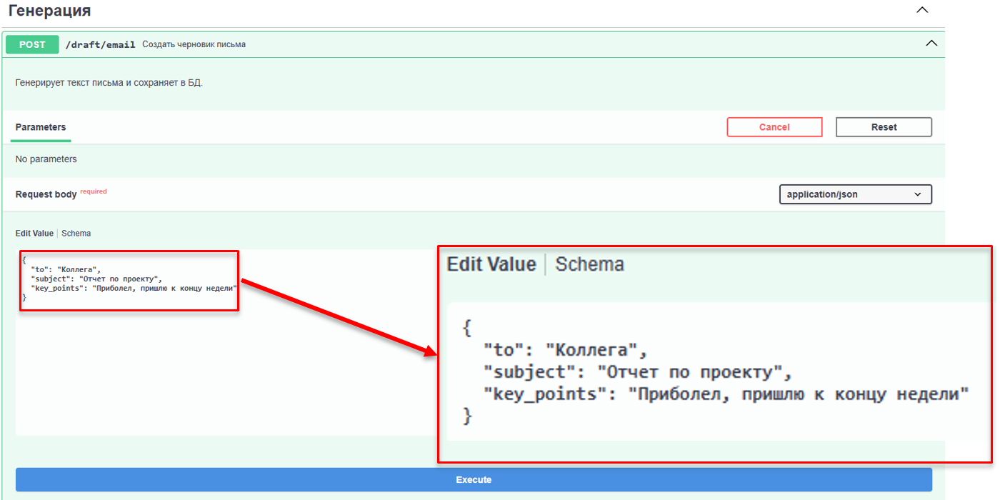
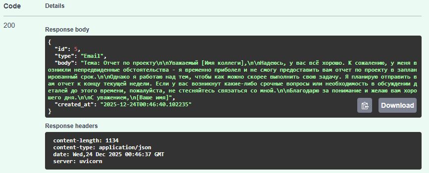
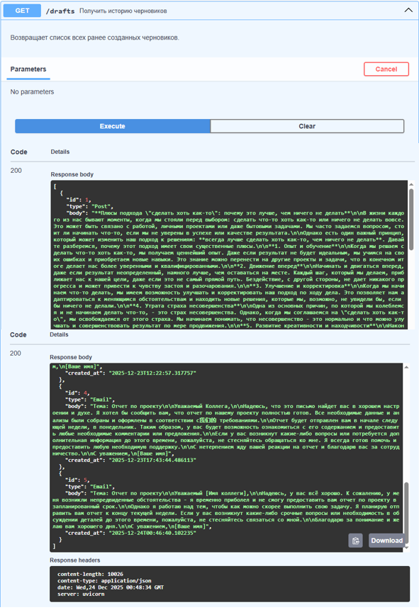

**Draft Helper API (Генератор черновиков)**

**1. Текст задания**

Описание предметной области: 
Разработать вспомогательный сервис для быстрого создания черновиков текстового контента, такого как электронные письма или посты в блог.

Ключевая задача: 
Интеграция с Большой Языковой Моделью (LLM) для генерации полноценного текста на основе входного контекста (тип контента, получатель, тема, тезисы).

Технические требования:

* Backend: **Python** с использованием фреймворка **FastAPI**.
* База данных: **SQLite** (использована **SQLAlchemy ORM**) для сохранения черновиков.
* LLM-сервис: Интеграция с моделью **Llama 3.3** через облачный **API Groq**.
* Документация: Автоматическая генерация **Swagger/OpenAPI**.

---

**2. Инструкция по запуску**

Подготовительный этап

Важно: 
**Перед запуском убедитесь, что у вас включено **VPN-соединение**, так как серверная инфраструктура нейросети (**Groq API**) может быть недоступна для прямых запросов.

Вариант 1. Запуск через **Docker** 
1.1 Откройте терминал в корневой папке проекта. 
1.2 Выполните команду для сборки и запуска: `docker-compose up --build` 
Дождитесь сообщения: `Application startup complete`.

Вариант 2. Локальный запуск 
2.1 Установите необходимые библиотеки: `pip install -r requirements.txt` 
2.2 Запустите сервер: `uvicorn main:app --reload`

Сервис будет доступен по адресу: `http://127.0.0.1:8000`.

---

**3. Визуальная инструкция (Работа с API)** 
Для взаимодействия с сервисом используется интерактивная документация **Swagger UI**. 
Адрес: `http://127.0.0.1:8000/docs`.

Шаг 1: Выбор метода
Выберите интересующий вас эндпоинт: `POST /draft/email` (для писем) или `POST /draft/post` (для постов).

 
(Рис. 1 — Общий вид документации **Swagger UI**) 

Шаг 2: Ввод данных 
Нажмите кнопку **Try it out**. 
Заполните тело запроса в формате **JSON**.

Пример для письма:
<pre>
{
  &quot;to&quot;: &quot;Коллега&quot;,
  &quot;subject&quot;: &quot;Отчет по проекту&quot;,
  &quot;key_points&quot;: &quot;Приболел, пришлю к концу недели.&quot;
}
</pre>

 
(Рис. 2 — Пример заполнения полей запроса) 

Шаг 3: Получение результата

Нажмите **Execute**. В блоке Responses отобразится сгенерированный нейросетью текст и **ID** записи в базе данных.

 
(Рис. 3 — Результат генерации) 

Шаг 4: Просмотр истории 
Для получения списка всех ранее созданных черновиков используйте метод `GET /drafts`.

 
(Рис. 4 — История черновиков из базы данных)
